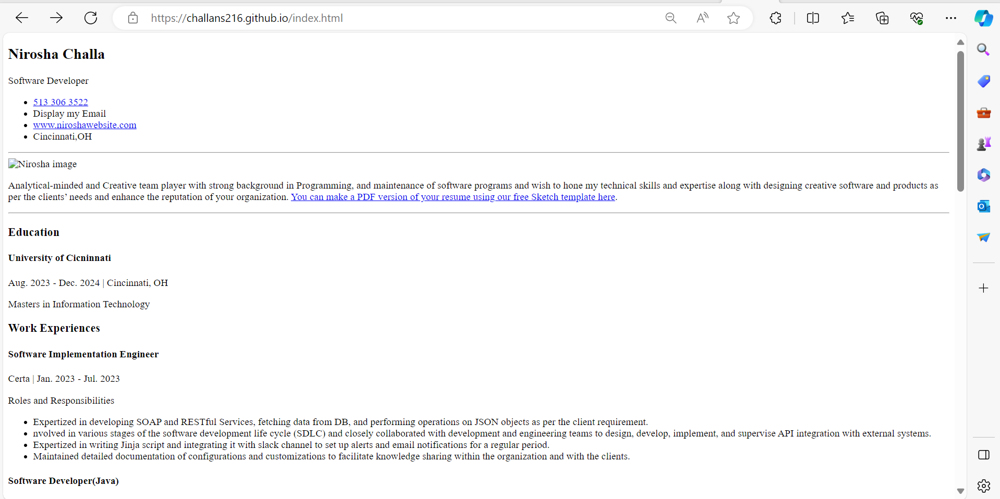
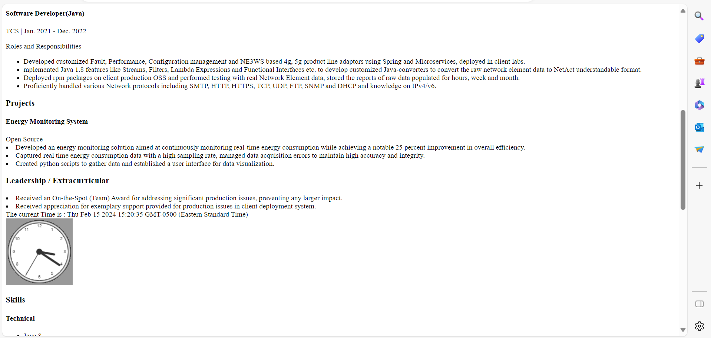
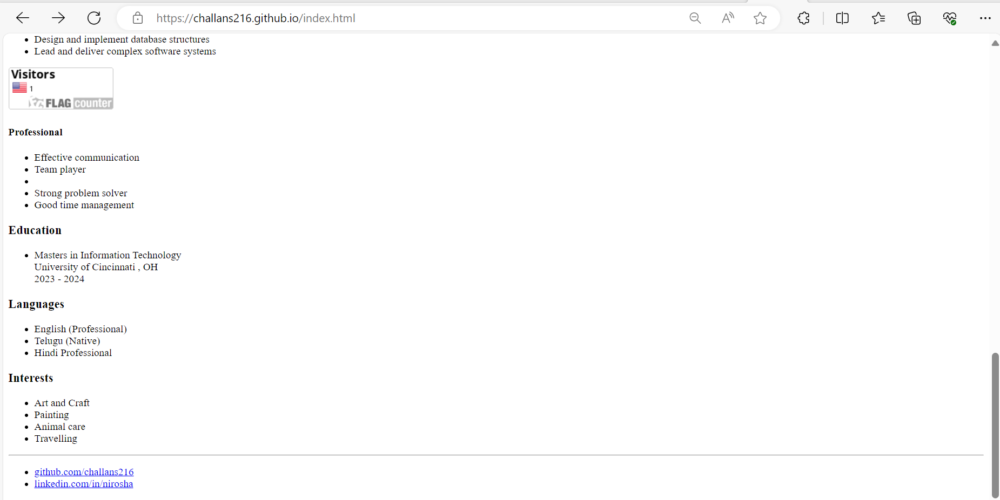
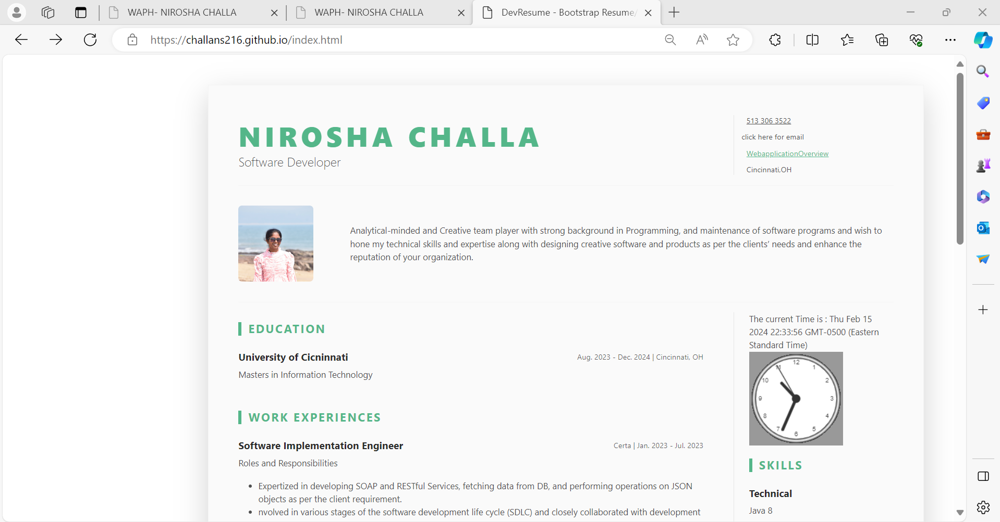
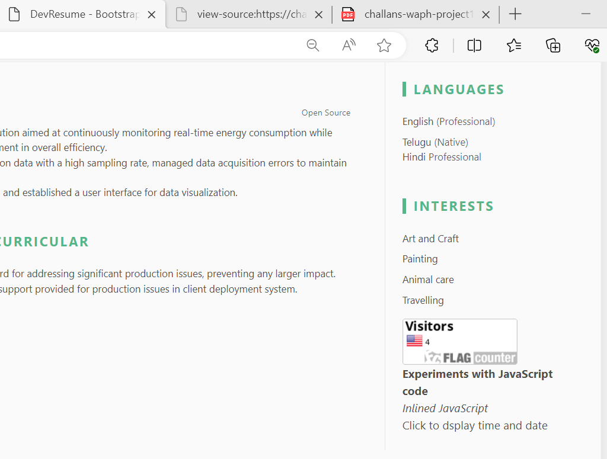
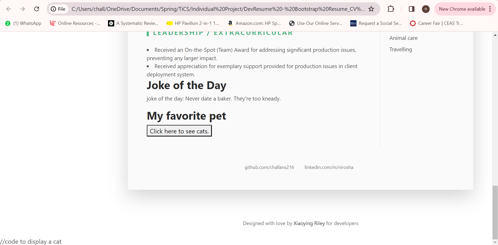
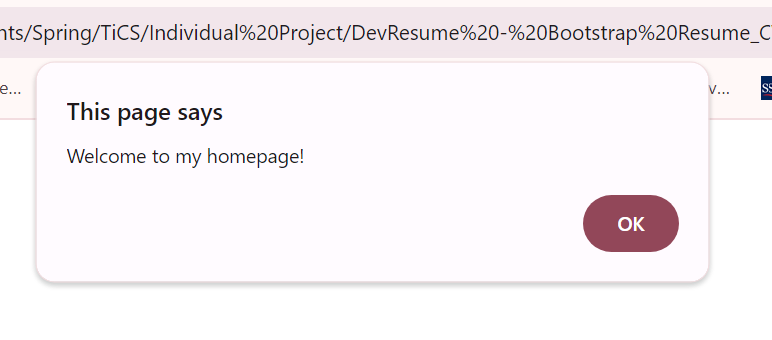
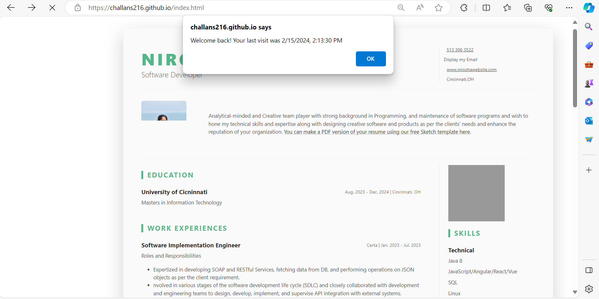

# WAPH-Web Application Programming and Hacking

## Instructor: Dr. Phu Phung

## Student

**Name**: Nirosha Challa

**Email**: challans@mail.uc.edu

{width=150px height=150px}

# Lab 1 - Foundations of the Web

## Overview : 
This project explores more into the web application development with front-end. As a part of this project, I understood how to create a professional webpage to add my resume details in it. This individual project comprised of all the labs and hackathons which i have performed till date. It includes all the skills which i have explored so far.
As a part of non technical i have collected a bootstrap theme to make my resume style to enhance its visibility. In the technical side we have used java script, integration of web api's which i have learned in lab2 and a new web api integration which has some graphics.
Some of the existing code like analog clock ,digital clock were used from the lab 1.
Finally every screenshot was captured and set in a README.md file and converted into markdown format using pandoc tool.

[https://github.com/challans216/waph-challans/blob/main/lab/lab1/README.md](https://github.com/challans216/waph-challans/blob/main/lab/lab1/README.md)

## Part 1 : General Requirements

Here i have created a new public repository with my username.github.io and created a profile which includes all the details that i can keep in my resume :education , experience, projects etc
Along with this i have created a html page  to introduce to web application programming and hacking which explains about the overview of lab0 , lab1, lab2 and hackathon1 which i have performed till now.
Below are the screenshots of the data.
Simple  HTML tags have been used to perform this.

 {width=300px height=300px}

## Part 2: Non- Technical Requirements
Here i have used a open source bootstrap framework to add styling to my resume. Along with that i have also used a flag counter. To use that i have provided few details to generate it accordingly like the no of countries that can be displayed in the image and other factors which helped me to generate a link. I have copied that link and used in the website in the href attribute which helped me to achieve it.

below are the screenshots:

## Part 3 -Technical Requirements

Here i have used code to implement few features that i have already implemented in my previous handson which includes analog clock, digital clock, showhide email and display date and time.

As a part of web api integration this time i was able to retrieve any joke from the web api using jquery framework. I just inserted the script code of jquery to achieve this and took the response from json and parsed it to get the output.

Similarilly , I have used another open source/public APi which can print my favorite pet with the framework vue.js. Since vue.js can also be included in the script tags without the need of installation.
I tried to get the image resposne by button click.

[!Cat API integration output](images/catAPI.png)

Finally i have written a code to remeber the client i.e cookies. I have took the reference from the demo code which was explained and printed the message.
when i first clicked the website it was able to generate the welcome message as  in the below screenshot.

From the next time it started to display the welcome message alobg with the date and time you last visited as in the below screenshot.

